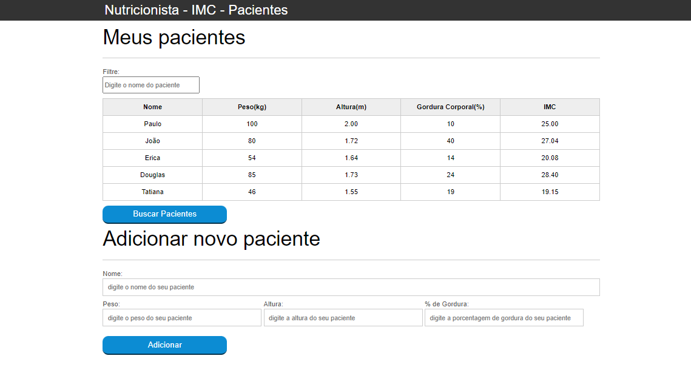

# Nutricionista-IMC-Pacientes
Projeto desenvolvido no curso de JavaScript programando na linuagem da Web.

O projeto conta com um cadastro de pacientes para Nutricionista. Com base nos dados cadastrados podemos calcular o IMC do paciente.
O projeto também conta com a função de buscar por paciente por meio de Regex. Através de um duplo click em cima de um paciente na tabela ele será excluido da tabela. Utilizando Ajax podemos importar informações externas de outros pacientes.

